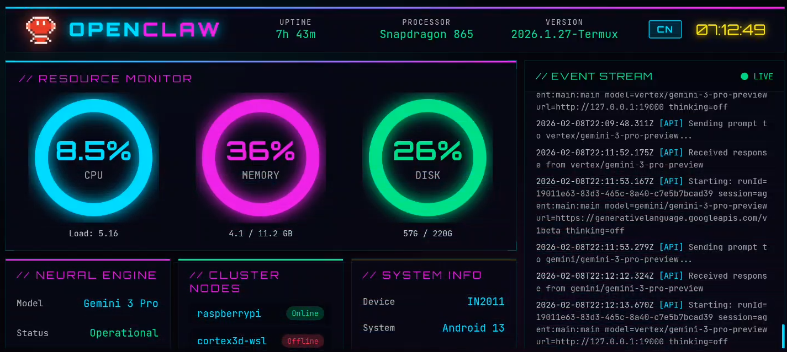

# OpenClaw

<p align="center">
  
</p>

**OpenClaw** (Termux Fork) is a Termux-optimized fork designed to run a personal AI assistant **natively on Android** without root access.

[中文文档](README_CN.md) | [English README](README.md)

## 🚀 Termux Compatibility Fork

> **Run full-featured OpenClaw on any Android device — even a $30 used phone!**

This fork maintains **100% feature parity** with the original OpenClaw while adding **native Termux/Android compatibility**. You get the same powerful AI assistant experience on a budget Android phone as you would on a high-end server.

### Why This Fork?

| Feature | Original OpenClaw | This Fork (Termux) |
|---------|-------------------|-------------------|
| macOS/Linux | ✅ | ✅ |
| Android/Termux | ❌ | ✅ |
| sqlite-vec | Prebuilt binaries | Compiled from source |
| Service management | systemd/launchd | PM2 |
| Hardware requirements | Server/Desktop | Any Android phone |

### Key Adaptations

- ✅ **Full Android/Termux compatibility** - no root required for basic usage
- ✅ **Original experience preserved** - identical features and UI
- ✅ **Budget-friendly** - runs on old/used Android phones ($30+)
- ✅ **Termux-specific path handling** - adapted for Android filesystem
- ✅ **sqlite-vec compiled from source** - works on arm64 Android
- ✅ **PM2 service management** - reliable background operation

See [ANDROID_FIXES.md](./ANDROID_FIXES.md) and [ANDROID_FIXES_CN.md](./ANDROID_FIXES_CN.md) for detailed compatibility patches.

### 📸 Gallery


<br>

|  |  |
|:---:|:---:|


### 📱 Advanced Capabilities (Sensors & Hardware)

Unlike running on a server or PC, OpenClaw on Android can interact directly with the physical world via **Termux API**.

> **Note**: Install the `Termux:API` app and run `pkg install termux-api` to unlock these features.

- **Sensors**: Access light, proximity, gravity sensors, and GPS location.
- **Haptic Feedback**: Communicate not just via voice but with **vibration** patterns and **flashlight** signals.
- **Multimedia**: Control music playback, volume, and use system-level TTS (Text-to-Speech).
- **Telephony**: Send/receive SMS, make calls, and access contacts directly.
- **App Interaction**: Launch other apps (`am start ...`) or perform deep linking.

**For Rooted Devices**:
With Root access, OpenClaw becomes a true **24/7 AI Server**:
- **Auto-Start**: Configure boot scripts for server-grade resilience (auto-recover after power loss).
- **Extreme Efficiency**: Mod for **Battery-less DC Power** to run 24x365 with negligible energy usage.
- **Remote Access**: Bind to 0.0.0.0 or use **Tailscale** to manage your assistant securely from anywhere.
- **Full Control**: Simulate touch inputs, manage system processes, and run unattended automations.

**Expandable Capabilities (via Termux API)**:
- 📸 **Vision**: Access front/rear cameras for photography, video recording, or home surveillance.
- 🔋 **Status**: Monitor battery level, WiFi signal strength, and Bluetooth connections.
- 🗣️ **Voice**: Use system TTS for speech output and microphone for offline wake-word detection.
- 📩 **Telephony**: Auto-read/send SMS, block spam calls, or act as an SMS forwarding gateway.

### 🛸 Ultimate Form: Matrix Cluster (Multi-Device)
When you have multiple idle phones, OpenClaw can form a **Local Distributed Cluster**:

- **Audio Matrix**: Create a microphone array for precise source localization or a surround sound system.
- **Visual Matrix**: 360° panoramic surveillance or "Bullet Time" multi-angle recording.
- **Edge Cluster**: Aggregate CPU power (e.g., 10x Snapdragon 865) to run larger local models via distributed inference.
- **Sensor Grid**: Scatter phones as independent nodes (light/noise/vibration) to build a true whole-house perception network.

---
## Models (selection + auth)

- Models config + CLI: [Models](https://docs.yunze7373.ai/concepts/models)
- Auth profile rotation (OAuth vs API keys) + fallbacks: [Model failover](https://docs.yunze7373.ai/concepts/model-failover)

## Install (recommended) - Termux

Runtime: **Node ≥22** (installed automatically by deploy script).

### One-Click Deploy (English)

```bash
# Clone and run
git clone https://github.com/yunze7373/openclaw-termux.git
cd openclaw-termux
./Install_termux.sh --full
```

### One-Click Deploy (Chinese Version)

```bash
# Clone and run
git clone https://github.com/yunze7373/openclaw-termux.git
cd openclaw-termux
./Install_termux_cn.sh --full
```


The script will:
1. Install dependencies (nodejs-lts, pnpm, pm2, etc.)
2. Configure environment variables
3. Build the project
4. Compile sqlite-vec from source for Android/arm64
5. Set up PM2 service

After deployment, run:
```bash
openclaw onboard --install-daemon
```

## Quick start (TL;DR) - Termux

Full beginner guide (auth, pairing, channels): [Getting started](https://docs.yunze7373.ai/start/getting-started)

```bash
# After deploy script completes:
source ~/.bashrc

openclaw onboard --install-daemon

openclaw gateway --port 18789 --verbose

# Send a message
openclaw message send --to +1234567890 --message "Hello from OpenClaw"

# Talk to the assistant
openclaw agent --message "Ship checklist" --thinking high
```

Upgrading? `./Install_termux.sh --update` or [Updating guide](https://docs.yunze7373.ai/install/updating).

## Development channels

- **stable**: tagged releases (`vYYYY.M.D` or `vYYYY.M.D-<patch>`), npm dist-tag `latest`.
- **beta**: prerelease tags (`vYYYY.M.D-beta.N`), npm dist-tag `beta`.
- **dev**: moving head of `main`, npm dist-tag `dev` (when published).

Switch channels (git + npm): `openclaw update --channel stable|beta|dev`.
Details: [Development channels](https://docs.yunze7373.ai/install/development-channels).

## From source (development) - Termux

For development and debugging on Termux:

```bash
git clone https://github.com/yunze7373/openclaw-termux.git
cd openclaw-termux

# Install dependencies only
./Install_termux.sh --deps

# Manual build steps for development
pnpm install --no-frozen-lockfile --ignore-scripts
pnpm exec tsdown
pnpm build:plugin-sdk:dts
pnpm ui:build

# Fix sqlite-vec for Android
./scripts/fix-sqlite-vec.sh

# Run with tsx (development mode)
node --import tsx openclaw.mjs gateway --port 18789 --verbose

# Or build and run
pnpm build
./openclaw.mjs gateway start
```

### Termux-specific Notes

- **Root not required for basic usage** - Gateway, messaging, AI agents all work in Termux userspace
- **With root access (optional)**, you can:
  - Use `iptables` for port forwarding (expose services on privileged ports like 80/443)
  - Access Android system services directly
  - Run background services more reliably via `init.d` or Magisk modules
  - Mount external storage with full permissions
- **sqlite-vec** - compiled from source for Android/arm64 (no prebuilt binaries)
- **PM2 recommended** - Termux lacks systemd, use PM2 for service management
- **SSL certificates** - configured automatically via `$PREFIX/etc/tls/cert.pem`

## Security defaults (DM access)

OpenClaw connects to real messaging surfaces. Treat inbound DMs as **untrusted input**.

Full security guide: [Security](https://docs.yunze7373.ai/gateway/security)

Default behavior on Telegram/WhatsApp/Signal/iMessage/Microsoft Teams/Discord/Google Chat/Slack:

- **DM pairing** (`dmPolicy="pairing"` / `channels.discord.dm.policy="pairing"` / `channels.slack.dm.policy="pairing"`): unknown senders receive a short pairing code and the bot does not process their message.
- Approve with: `openclaw pairing approve <channel> <code>` (then the sender is added to a local allowlist store).
- Public inbound DMs require an explicit opt-in: set `dmPolicy="open"` and include `"*"` in the channel allowlist (`allowFrom` / `channels.discord.dm.allowFrom` / `channels.slack.dm.allowFrom`).

Run `openclaw doctor` to surface risky/misconfigured DM policies.

## Highlights

- **[Local-first Gateway](https://docs.yunze7373.ai/gateway)** — single control plane for sessions, channels, tools, and events.
- **[Multi-channel inbox](https://docs.yunze7373.ai/channels)** — WhatsApp, Telegram, Slack, Discord, Google Chat, Signal, BlueBubbles (iMessage), iMessage (legacy), Microsoft Teams, Matrix, Zalo, Zalo Personal, WebChat, macOS, iOS/Android.
- **[Multi-agent routing](https://docs.yunze7373.ai/gateway/configuration)** — route inbound channels/accounts/peers to isolated agents (workspaces + per-agent sessions).
- **[Voice Wake](https://docs.yunze7373.ai/nodes/voicewake) + [Talk Mode](https://docs.yunze7373.ai/nodes/talk)** — always-on speech for macOS/iOS/Android with ElevenLabs.
- **[Live Canvas](https://docs.yunze7373.ai/platforms/mac/canvas)** — agent-driven visual workspace with [A2UI](https://docs.yunze7373.ai/platforms/mac/canvas#canvas-a2ui).
- **[First-class tools](https://docs.yunze7373.ai/tools)** — browser, canvas, nodes, cron, sessions, and Discord/Slack actions.
- **[Companion apps](https://docs.yunze7373.ai/platforms/macos)** — macOS menu bar app + iOS/Android [nodes](https://docs.yunze7373.ai/nodes).
- **[Onboarding](https://docs.yunze7373.ai/start/wizard) + [skills](https://docs.yunze7373.ai/tools/skills)** — wizard-driven setup with bundled/managed/workspace skills.

## Star History

[](https://star-history.com/#yunze7373/openclaw-termux&Date)

## Everything we built so far

### Core platform

- [Gateway WS control plane](https://docs.yunze7373.ai/gateway) with sessions, presence, config, cron, webhooks, [Control UI](https://docs.yunze7373.ai/web), and [Canvas host](https://docs.yunze7373.ai/platforms/mac/canvas#canvas-a2ui).
- [CLI surface](https://docs.yunze7373.ai/tools/agent-send): gateway, agent, send, [wizard](https://docs.yunze7373.ai/start/wizard), and [doctor](https://docs.yunze7373.ai/gateway/doctor).
- [Pi agent runtime](https://docs.yunze7373.ai/concepts/agent) in RPC mode with tool streaming and block streaming.
- [Session model](https://docs.yunze7373.ai/concepts/session): `main` for direct chats, group isolation, activation modes, queue modes, reply-back. Group rules: [Groups](https://docs.yunze7373.ai/concepts/groups).
- [Media pipeline](https://docs.yunze7373.ai/nodes/images): images/audio/video, transcription hooks, size caps, temp file lifecycle. Audio details: [Audio](https://docs.yunze7373.ai/nodes/audio).

### Channels

- [Channels](https://docs.yunze7373.ai/channels): [WhatsApp](https://docs.yunze7373.ai/channels/whatsapp) (Baileys), [Telegram](https://docs.yunze7373.ai/channels/telegram) (grammY), [Slack](https://docs.yunze7373.ai/channels/slack) (Bolt), [Discord](https://docs.yunze7373.ai/channels/discord) (discord.js), [Google Chat](https://docs.yunze7373.ai/channels/googlechat) (Chat API), [Signal](https://docs.yunze7373.ai/channels/signal) (signal-cli), [BlueBubbles](https://docs.yunze7373.ai/channels/bluebubbles) (iMessage, recommended), [iMessage](https://docs.yunze7373.ai/channels/imessage) (legacy imsg), [Microsoft Teams](https://docs.yunze7373.ai/channels/msteams) (extension), [Matrix](https://docs.yunze7373.ai/channels/matrix) (extension), [Zalo](https://docs.yunze7373.ai/channels/zalo) (extension), [Zalo Personal](https://docs.yunze7373.ai/channels/zalouser) (extension), [WebChat](https://docs.yunze7373.ai/web/webchat).
- [Group routing](https://docs.yunze7373.ai/concepts/group-messages): mention gating, reply tags, per-channel chunking and routing. Channel rules: [Channels](https://docs.yunze7373.ai/channels).

### Apps + nodes

- [macOS app](https://docs.yunze7373.ai/platforms/macos): menu bar control plane, [Voice Wake](https://docs.yunze7373.ai/nodes/voicewake)/PTT, [Talk Mode](https://docs.yunze7373.ai/nodes/talk) overlay, [WebChat](https://docs.yunze7373.ai/web/webchat), debug tools, [remote gateway](https://docs.yunze7373.ai/gateway/remote) control.
- [iOS node](https://docs.yunze7373.ai/platforms/ios): [Canvas](https://docs.yunze7373.ai/platforms/mac/canvas), [Voice Wake](https://docs.yunze7373.ai/nodes/voicewake), [Talk Mode](https://docs.yunze7373.ai/nodes/talk), camera, screen recording, Bonjour pairing.
- [Android node](https://docs.yunze7373.ai/platforms/android): [Canvas](https://docs.yunze7373.ai/platforms/mac/canvas), [Talk Mode](https://docs.yunze7373.ai/nodes/talk), camera, screen recording, optional SMS.
- [macOS node mode](https://docs.yunze7373.ai/nodes): system.run/notify + canvas/camera exposure.

### Tools + automation

- [Browser control](https://docs.yunze7373.ai/tools/browser): dedicated openclaw Chrome/Chromium, snapshots, actions, uploads, profiles.
- [Canvas](https://docs.yunze7373.ai/platforms/mac/canvas): [A2UI](https://docs.yunze7373.ai/platforms/mac/canvas#canvas-a2ui) push/reset, eval, snapshot.
- [Nodes](https://docs.yunze7373.ai/nodes): camera snap/clip, screen record, [location.get](https://docs.yunze7373.ai/nodes/location-command), notifications.
- [Cron + wakeups](https://docs.yunze7373.ai/automation/cron-jobs); [webhooks](https://docs.yunze7373.ai/automation/webhook); [Gmail Pub/Sub](https://docs.yunze7373.ai/automation/gmail-pubsub).
- [Skills platform](https://docs.yunze7373.ai/tools/skills): bundled, managed, and workspace skills with install gating + UI.

### Runtime + safety

- [Channel routing](https://docs.yunze7373.ai/concepts/channel-routing), [retry policy](https://docs.yunze7373.ai/concepts/retry), and [streaming/chunking](https://docs.yunze7373.ai/concepts/streaming).
- [Presence](https://docs.yunze7373.ai/concepts/presence), [typing indicators](https://docs.yunze7373.ai/concepts/typing-indicators), and [usage tracking](https://docs.yunze7373.ai/concepts/usage-tracking).
- [Models](https://docs.yunze7373.ai/concepts/models), [model failover](https://docs.yunze7373.ai/concepts/model-failover), and [session pruning](https://docs.yunze7373.ai/concepts/session-pruning).
- [Security](https://docs.yunze7373.ai/gateway/security) and [troubleshooting](https://docs.yunze7373.ai/channels/troubleshooting).

### Ops + packaging

- [Control UI](https://docs.yunze7373.ai/web) + [WebChat](https://docs.yunze7373.ai/web/webchat) served directly from the Gateway.
- [Tailscale Serve/Funnel](https://docs.yunze7373.ai/gateway/tailscale) or [SSH tunnels](https://docs.yunze7373.ai/gateway/remote) with token/password auth.
- [Nix mode](https://docs.yunze7373.ai/install/nix) for declarative config; [Docker](https://docs.yunze7373.ai/install/docker)-based installs.
- [Doctor](https://docs.yunze7373.ai/gateway/doctor) migrations, [logging](https://docs.yunze7373.ai/logging).

## How it works (short)

```
WhatsApp / Telegram / Slack / Discord / Google Chat / Signal / iMessage / BlueBubbles / Microsoft Teams / Matrix / Zalo / Zalo Personal / WebChat
               │
               ▼
┌───────────────────────────────┐
│            Gateway            │
│       (control plane)         │
│     ws://127.0.0.1:18789      │
└──────────────┬────────────────┘
               │
               ├─ Pi agent (RPC)
               ├─ CLI (openclaw …)
               ├─ WebChat UI
               ├─ macOS app
               └─ iOS / Android nodes
```

## Key subsystems

- **[Gateway WebSocket network](https://docs.yunze7373.ai/concepts/architecture)** — single WS control plane for clients, tools, and events (plus ops: [Gateway runbook](https://docs.yunze7373.ai/gateway)).
- **[Tailscale exposure](https://docs.yunze7373.ai/gateway/tailscale)** — Serve/Funnel for the Gateway dashboard + WS (remote access: [Remote](https://docs.yunze7373.ai/gateway/remote)).
- **[Browser control](https://docs.yunze7373.ai/tools/browser)** — openclaw‑managed Chrome/Chromium with CDP control.
- **[Canvas + A2UI](https://docs.yunze7373.ai/platforms/mac/canvas)** — agent‑driven visual workspace (A2UI host: [Canvas/A2UI](https://docs.yunze7373.ai/platforms/mac/canvas#canvas-a2ui)).
- **[Voice Wake](https://docs.yunze7373.ai/nodes/voicewake) + [Talk Mode](https://docs.yunze7373.ai/nodes/talk)** — always‑on speech and continuous conversation.
- **[Nodes](https://docs.yunze7373.ai/nodes)** — Canvas, camera snap/clip, screen record, `location.get`, notifications, plus macOS‑only `system.run`/`system.notify`.

## Tailscale access (Gateway dashboard)

OpenClaw can auto-configure Tailscale **Serve** (tailnet-only) or **Funnel** (public) while the Gateway stays bound to loopback. Configure `gateway.tailscale.mode`:

- `off`: no Tailscale automation (default).
- `serve`: tailnet-only HTTPS via `tailscale serve` (uses Tailscale identity headers by default).
- `funnel`: public HTTPS via `tailscale funnel` (requires shared password auth).

Notes:

- `gateway.bind` must stay `loopback` when Serve/Funnel is enabled (OpenClaw enforces this).
- Serve can be forced to require a password by setting `gateway.auth.mode: "password"` or `gateway.auth.allowTailscale: false`.
- Funnel refuses to start unless `gateway.auth.mode: "password"` is set.
- Optional: `gateway.tailscale.resetOnExit` to undo Serve/Funnel on shutdown.

Details: [Tailscale guide](https://docs.yunze7373.ai/gateway/tailscale) · [Web surfaces](https://docs.yunze7373.ai/web)

## Remote Gateway (Linux is great)

It’s perfectly fine to run the Gateway on a small Linux instance. Clients (macOS app, CLI, WebChat) can connect over **Tailscale Serve/Funnel** or **SSH tunnels**, and you can still pair device nodes (macOS/iOS/Android) to execute device‑local actions when needed.

- **Gateway host** runs the exec tool and channel connections by default.
- **Device nodes** run device‑local actions (`system.run`, camera, screen recording, notifications) via `node.invoke`.
  In short: exec runs where the Gateway lives; device actions run where the device lives.

Details: [Remote access](https://docs.yunze7373.ai/gateway/remote) · [Nodes](https://docs.yunze7373.ai/nodes) · [Security](https://docs.yunze7373.ai/gateway/security)

## macOS permissions via the Gateway protocol

The macOS app can run in **node mode** and advertises its capabilities + permission map over the Gateway WebSocket (`node.list` / `node.describe`). Clients can then execute local actions via `node.invoke`:

- `system.run` runs a local command and returns stdout/stderr/exit code; set `needsScreenRecording: true` to require screen-recording permission (otherwise you’ll get `PERMISSION_MISSING`).
- `system.notify` posts a user notification and fails if notifications are denied.
- `canvas.*`, `camera.*`, `screen.record`, and `location.get` are also routed via `node.invoke` and follow TCC permission status.

Elevated bash (host permissions) is separate from macOS TCC:

- Use `/elevated on|off` to toggle per‑session elevated access when enabled + allowlisted.
- Gateway persists the per‑session toggle via `sessions.patch` (WS method) alongside `thinkingLevel`, `verboseLevel`, `model`, `sendPolicy`, and `groupActivation`.

Details: [Nodes](https://docs.yunze7373.ai/nodes) · [macOS app](https://docs.yunze7373.ai/platforms/macos) · [Gateway protocol](https://docs.yunze7373.ai/concepts/architecture)

## Agent to Agent (sessions\_\* tools)

- Use these to coordinate work across sessions without jumping between chat surfaces.
- `sessions_list` — discover active sessions (agents) and their metadata.
- `sessions_history` — fetch transcript logs for a session.
- `sessions_send` — message another session; optional reply‑back ping‑pong + announce step (`REPLY_SKIP`, `ANNOUNCE_SKIP`).

Details: [Session tools](https://docs.yunze7373.ai/concepts/session-tool)

## Skills registry (ClawHub)

ClawHub is a minimal skill registry. With ClawHub enabled, the agent can search for skills automatically and pull in new ones as needed.

[ClawHub](https://clawhub.com)

## Chat commands

Send these in WhatsApp/Telegram/Slack/Google Chat/Microsoft Teams/WebChat (group commands are owner-only):

- `/status` — compact session status (model + tokens, cost when available)
- `/new` or `/reset` — reset the session
- `/compact` — compact session context (summary)
- `/think <level>` — off|minimal|low|medium|high|xhigh (GPT-5.2 + Codex models only)
- `/verbose on|off`
- `/usage off|tokens|full` — per-response usage footer
- `/restart` — restart the gateway (owner-only in groups)
- `/activation mention|always` — group activation toggle (groups only)

## Apps (optional)

The Gateway alone delivers a great experience. All apps are optional and add extra features.

If you plan to build/run companion apps, follow the platform runbooks below.

### macOS (OpenClaw.app) (optional)

- Menu bar control for the Gateway and health.
- Voice Wake + push-to-talk overlay.
- WebChat + debug tools.
- Remote gateway control over SSH.

Note: signed builds required for macOS permissions to stick across rebuilds (see `docs/mac/permissions.md`).

### iOS node (optional)

- Pairs as a node via the Bridge.
- Voice trigger forwarding + Canvas surface.
- Controlled via `openclaw nodes …`.

Runbook: [iOS connect](https://docs.yunze7373.ai/platforms/ios).

### Android node (optional)

- Pairs via the same Bridge + pairing flow as iOS.
- Exposes Canvas, Camera, and Screen capture commands.
- Runbook: [Android connect](https://docs.yunze7373.ai/platforms/android).

## Agent workspace + skills

- Workspace root: `~/.openclaw/workspace` (configurable via `agents.defaults.workspace`).
- Injected prompt files: `AGENTS.md`, `SOUL.md`, `TOOLS.md`.
- Skills: `~/.openclaw/workspace/skills/<skill>/SKILL.md`.

## Configuration

Minimal `~/.yunze7373/yunze7373.json` (model + defaults):

```json5
{
  agent: {
    model: "anthropic/claude-opus-4-6",
  },
}
```

[Full configuration reference (all keys + examples).](https://docs.yunze7373.ai/gateway/configuration)

## Security model (important)

- **Default:** tools run on the host for the **main** session, so the agent has full access when it’s just you.
- **Group/channel safety:** set `agents.defaults.sandbox.mode: "non-main"` to run **non‑main sessions** (groups/channels) inside per‑session Docker sandboxes; bash then runs in Docker for those sessions.
- **Sandbox defaults:** allowlist `bash`, `process`, `read`, `write`, `edit`, `sessions_list`, `sessions_history`, `sessions_send`, `sessions_spawn`; denylist `browser`, `canvas`, `nodes`, `cron`, `discord`, `gateway`.

Details: [Security guide](https://docs.yunze7373.ai/gateway/security) · [Docker + sandboxing](https://docs.yunze7373.ai/install/docker) · [Sandbox config](https://docs.yunze7373.ai/gateway/configuration)

### [WhatsApp](https://docs.yunze7373.ai/channels/whatsapp)

- Link the device: `pnpm openclaw channels login` (stores creds in `~/.openclaw/credentials`).
- Allowlist who can talk to the assistant via `channels.whatsapp.allowFrom`.
- If `channels.whatsapp.groups` is set, it becomes a group allowlist; include `"*"` to allow all.

### [Telegram](https://docs.yunze7373.ai/channels/telegram)

- Set `TELEGRAM_BOT_TOKEN` or `channels.telegram.botToken` (env wins).
- Optional: set `channels.telegram.groups` (with `channels.telegram.groups."*".requireMention`); when set, it is a group allowlist (include `"*"` to allow all). Also `channels.telegram.allowFrom` or `channels.telegram.webhookUrl` + `channels.telegram.webhookSecret` as needed.

```json5
{
  channels: {
    telegram: {
      botToken: "123456:ABCDEF",
    },
  },
}
```

### [Slack](https://docs.yunze7373.ai/channels/slack)

- Set `SLACK_BOT_TOKEN` + `SLACK_APP_TOKEN` (or `channels.slack.botToken` + `channels.slack.appToken`).

### [Discord](https://docs.yunze7373.ai/channels/discord)

- Set `DISCORD_BOT_TOKEN` or `channels.discord.token` (env wins).
- Optional: set `commands.native`, `commands.text`, or `commands.useAccessGroups`, plus `channels.discord.dm.allowFrom`, `channels.discord.guilds`, or `channels.discord.mediaMaxMb` as needed.

```json5
{
  channels: {
    discord: {
      token: "1234abcd",
    },
  },
}
```

### [Signal](https://docs.yunze7373.ai/channels/signal)

- Requires `signal-cli` and a `channels.signal` config section.

### [BlueBubbles (iMessage)](https://docs.yunze7373.ai/channels/bluebubbles)

- **Recommended** iMessage integration.
- Configure `channels.bluebubbles.serverUrl` + `channels.bluebubbles.password` and a webhook (`channels.bluebubbles.webhookPath`).
- The BlueBubbles server runs on macOS; the Gateway can run on macOS or elsewhere.

### [iMessage (legacy)](https://docs.yunze7373.ai/channels/imessage)

- Legacy macOS-only integration via `imsg` (Messages must be signed in).
- If `channels.imessage.groups` is set, it becomes a group allowlist; include `"*"` to allow all.

### [Microsoft Teams](https://docs.yunze7373.ai/channels/msteams)

- Configure a Teams app + Bot Framework, then add a `msteams` config section.
- Allowlist who can talk via `msteams.allowFrom`; group access via `msteams.groupAllowFrom` or `msteams.groupPolicy: "open"`.

### [WebChat](https://docs.yunze7373.ai/web/webchat)

- Uses the Gateway WebSocket; no separate WebChat port/config.

Browser control (optional):

```json5
{
  browser: {
    enabled: true,
    color: "#FF4500",
  },
}
```

## Docs

Use these when you’re past the onboarding flow and want the deeper reference.

- [Start with the docs index for navigation and “what’s where.”](https://docs.yunze7373.ai)
- [Read the architecture overview for the gateway + protocol model.](https://docs.yunze7373.ai/concepts/architecture)
- [Use the full configuration reference when you need every key and example.](https://docs.yunze7373.ai/gateway/configuration)
- [Run the Gateway by the book with the operational runbook.](https://docs.yunze7373.ai/gateway)
- [Learn how the Control UI/Web surfaces work and how to expose them safely.](https://docs.yunze7373.ai/web)
- [Understand remote access over SSH tunnels or tailnets.](https://docs.yunze7373.ai/gateway/remote)
- [Follow the onboarding wizard flow for a guided setup.](https://docs.yunze7373.ai/start/wizard)
- [Wire external triggers via the webhook surface.](https://docs.yunze7373.ai/automation/webhook)
- [Set up Gmail Pub/Sub triggers.](https://docs.yunze7373.ai/automation/gmail-pubsub)
- [Learn the macOS menu bar companion details.](https://docs.yunze7373.ai/platforms/mac/menu-bar)
- [Platform guides: Windows (WSL2)](https://docs.yunze7373.ai/platforms/windows), [Linux](https://docs.yunze7373.ai/platforms/linux), [macOS](https://docs.yunze7373.ai/platforms/macos), [iOS](https://docs.yunze7373.ai/platforms/ios), [Android](https://docs.yunze7373.ai/platforms/android)
- [Debug common failures with the troubleshooting guide.](https://docs.yunze7373.ai/channels/troubleshooting)
- [Review security guidance before exposing anything.](https://docs.yunze7373.ai/gateway/security)

## Advanced docs (discovery + control)

- [Discovery + transports](https://docs.yunze7373.ai/gateway/discovery)
- [Bonjour/mDNS](https://docs.yunze7373.ai/gateway/bonjour)
- [Gateway pairing](https://docs.yunze7373.ai/gateway/pairing)
- [Remote gateway README](https://docs.yunze7373.ai/gateway/remote-gateway-readme)
- [Control UI](https://docs.yunze7373.ai/web/control-ui)
- [Dashboard](https://docs.yunze7373.ai/web/dashboard)

## Operations & troubleshooting

- [Health checks](https://docs.yunze7373.ai/gateway/health)
- [Gateway lock](https://docs.yunze7373.ai/gateway/gateway-lock)
- [Background process](https://docs.yunze7373.ai/gateway/background-process)
- [Browser troubleshooting (Linux)](https://docs.yunze7373.ai/tools/browser-linux-troubleshooting)
- [Logging](https://docs.yunze7373.ai/logging)

## Deep dives

- [Agent loop](https://docs.yunze7373.ai/concepts/agent-loop)
- [Presence](https://docs.yunze7373.ai/concepts/presence)
- [TypeBox schemas](https://docs.yunze7373.ai/concepts/typebox)
- [RPC adapters](https://docs.yunze7373.ai/reference/rpc)
- [Queue](https://docs.yunze7373.ai/concepts/queue)

## Workspace & skills

- [Skills config](https://docs.yunze7373.ai/tools/skills-config)
- [Default AGENTS](https://docs.yunze7373.ai/reference/AGENTS.default)
- [Templates: AGENTS](https://docs.yunze7373.ai/reference/templates/AGENTS)
- [Templates: BOOTSTRAP](https://docs.yunze7373.ai/reference/templates/BOOTSTRAP)
- [Templates: IDENTITY](https://docs.yunze7373.ai/reference/templates/IDENTITY)
- [Templates: SOUL](https://docs.yunze7373.ai/reference/templates/SOUL)
- [Templates: TOOLS](https://docs.yunze7373.ai/reference/templates/TOOLS)
- [Templates: USER](https://docs.yunze7373.ai/reference/templates/USER)

## Platform internals

- [macOS dev setup](https://docs.yunze7373.ai/platforms/mac/dev-setup)
- [macOS menu bar](https://docs.yunze7373.ai/platforms/mac/menu-bar)
- [macOS voice wake](https://docs.yunze7373.ai/platforms/mac/voicewake)
- [iOS node](https://docs.openclaw.ai/platforms/ios)
- [Android node](https://docs.openclaw.ai/platforms/android)
- [Windows (WSL2)](https://docs.openclaw.ai/platforms/windows)
- [Linux app](https://docs.openclaw.ai/platforms/linux)

## Email hooks (Gmail)

- [docs.openclaw.ai/gmail-pubsub](https://docs.openclaw.ai/automation/gmail-pubsub)


## Android (Termux) Compatibility

This fork is specifically optimized for running **OpenClaw on Android via Termux**. We have implemented over 50 compatibility fixes to ensure a stable and feature-rich experience on mobile devices.

### Key Adaptations

- **Skill Compatibility Layer**: The built-in skill installer (`skills-install.ts`) has been rewritten to:
  - Automatically map macOS `brew` formulas to Termux `pkg` packages (e.g., `go` → `golang`).
  - Handle global npm installs by correctly setting `PNPM_HOME`.
  - Gracefully skip incompatible macOS-only formulas with clear notifications.
  - Support over 95% of the official skill library on Android.

- **Core Stability**:
  - **Clipboard**: Patched `@mariozechner/clipboard` to use `termux-api` for native clipboard access.
  - **Path Resolution**: Fixed binary path detection for `node`, `npm`, `go`, and other tools in the Termux environment.
  - **Service Management**: Implemented a "Manual (Android)" service manager to bypass systemd/launchd dependencies.

- **Memory & Storage**:
  - **Auto-Archiving**: Implemented a tiered memory architecture that automatically archives `MEMORY.md` when it exceeds 25k chars, preventing context loss.
  - **Vector Search**: Added a fallback proxy to Supabase for vector operations, as local `sqlite-vec` limits are problematic on Android.

- **Browser Automation**:
  - Enabled **Headless Chromium** support with Termux-specific flags, allowing full browser automation capabilities on mobile.

For a detailed list of all fixes, see [ANDROID_FIXES.md](ANDROID_FIXES.md).

## Community

See [CONTRIBUTING.md](CONTRIBUTING.md) for guidelines, maintainers, and how to submit PRs.
AI/vibe-coded PRs welcome! 🤖

- **Follow usage**: [X (Twitter) @hanyz_eth](https://x.com/hanyz_eth)

Special thanks to [Mario Zechner](https://mariozechner.at/) for his support and for
[pi-mono](https://github.com/badlogic/pi-mono).
Special thanks to Adam Doppelt for lobster.bot.

Thanks to all clawtributors:
