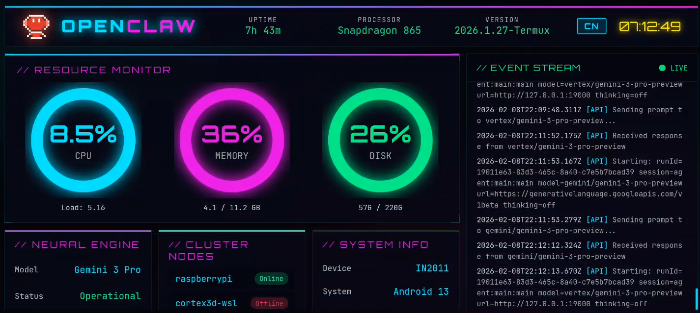
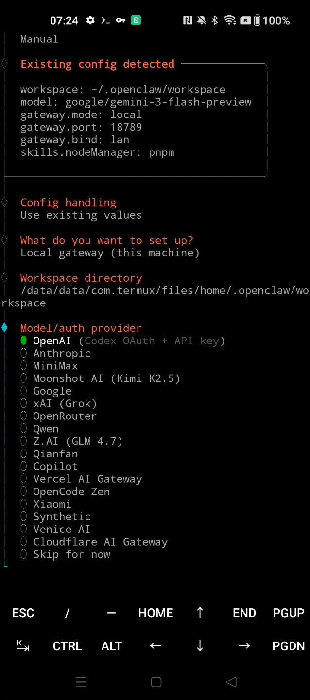
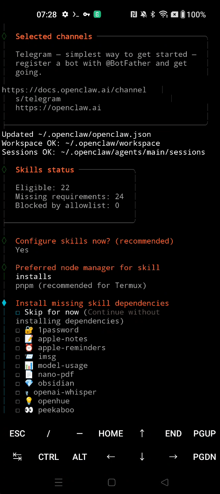

# 🦞 OpenClaw — Personal AI Assistant (Termux Fork)

<p align="center">
    <picture>
        <source media="(prefers-color-scheme: light)" srcset="https://raw.githubusercontent.com/openclaw/openclaw/main/docs/assets/openclaw-logo-text-dark.png">
        
    </picture>
</p>

<p align="center">
  <strong>EXFOLIATE! EXFOLIATE!</strong>
</p>

<p align="center">
  <a href="https://github.com/yunze7373/openclaw-termux/actions/workflows/ci.yml?branch=main"></a>
  <a href="https://github.com/yunze7373/openclaw-termux/releases"></a>
  <a href="https://discord.gg/clawd"></a>
  <a href="LICENSE"></a>
</p>

**OpenClaw (Termux Fork)** is a _personal AI assistant_ optimized for **Android/Termux** devices.
It answers you on the channels you already use (WhatsApp, Telegram, Slack, Discord, Google Chat, Signal, iMessage, BlueBubbles, IRC, Microsoft Teams, Matrix, Feishu, LINE, Mattermost, Nextcloud Talk, Nostr, Synology Chat, Tlon, Twitch, Zalo, Zalo Personal, WebChat). It can speak and listen on macOS/iOS/Android, and can render a live Canvas you control.

> **🚀 Run full-featured OpenClaw on any Android device — even a $30 used phone!**

This fork maintains **100% feature parity** with the original OpenClaw while adding **native Termux/Android compatibility**. You get the same powerful AI assistant experience on a budget Android phone as you would on a high-end server.

---

## 📱 Termux Features

| Feature | Original OpenClaw | This Fork (Termux) |
|---------|-------------------|-------------------|
| macOS/Linux | ✅ | ✅ |
| Android/Termux | ❌ | ✅ |
| sqlite-vec | Prebuilt binaries | Compiled from source |
| Service management | systemd/launchd | PM2 |
| Hardware requirements | Server/Desktop | Any Android phone |

### Key Adaptations

- ✅ **Full Android/Termux compatibility** - no root required for basic usage
- ✅ **Original experience preserved** - identical features and UI
- ✅ **Budget-friendly** - runs on old/used Android phones ($30+)
- ✅ **Termux-specific path handling** - adapted for Android filesystem
- ✅ **sqlite-vec compiled from source** - works on arm64 Android
- ✅ **PM2 service management** - reliable background operation

### 📸 Gallery


<br>

|  |  |
|:---:|:---:|

---

## 🛠️ Advanced Android Capabilities (via Termux API)

Unlike running on a server or PC, OpenClaw on Android can interact directly with the physical world via **Termux API**.

> **Note**: Install the `Termux:API` app and run `pkg install termux-api` to unlock these features.

- **Sensors**: Access light, proximity, gravity sensors, and GPS location.
- **Haptic Feedback**: Communicate not just via voice but with **vibration** patterns and **flashlight** signals.
- **Multimedia**: Control music playback, volume, and use system-level TTS (Text-to-Speech).
- **Telephony**: Send/receive SMS, make calls, and access contacts directly.
- **App Interaction**: Launch other apps (`am start ...`) or perform deep linking.

### For Rooted Devices

With Root access, OpenClaw becomes a true **24/7 AI Server**:
- **Auto-Start**: Configure boot scripts for server-grade resilience (auto-recover after power loss).
- **Extreme Efficiency**: Mod for **Battery-less DC Power** to run 24x365 with negligible energy usage.
- **Remote Access**: Bind to 0.0.0.0 or use **Tailscale** to manage your assistant securely from anywhere.
- **Full Control**: Simulate touch inputs, manage system processes, and run unattended automations.

### Expandable Capabilities

- 📸 **Vision**: Access front/rear cameras for photography, video recording, or home surveillance.
- 🔋 **Status**: Monitor battery level, WiFi signal strength, and Bluetooth connections.
- 🗣️ **Voice**: Use system TTS for speech output and microphone for offline wake-word detection.
- 📩 **Telephony**: Auto-read/send SMS, block spam calls, or act as an SMS forwarding gateway.

### 🛸 Ultimate Form: Matrix Cluster (Multi-Device)

When you have multiple idle phones, OpenClaw can form a **Local Distributed Cluster**:

- **Audio Matrix**: Create a microphone array for precise source localization or a surround sound system.
- **Visual Matrix**: 360° panoramic surveillance or "Bullet Time" multi-angle recording.
- **Edge Cluster**: Aggregate CPU power (e.g., 10x Snapdragon 865) to run larger local models via distributed inference.
- **Sensor Grid**: Scatter phones as independent nodes (light/noise/vibration) to build a true whole-house perception network.

---

## 📦 Install (Termux)

**Runtime**: Node ≥22 (installed automatically by deploy script).

### One-Click Deploy

```bash
# Clone and run
git clone https://github.com/yunze7373/openclaw-termux.git
cd openclaw-termux
./Install_termux_cn.sh --full
```

### Manual Install

```bash
# Install dependencies
pkg update && pkg upgrade
pkg install nodejs-lts git curl jq

# Install pnpm
curl -fsSL https://get.pnpm.io/install.sh | sh -

# Clone and build
git clone https://github.com/yunze7373/openclaw-termux.git
cd openclaw-termux
pnpm install
pnpm build

# Start gateway
pnpm openclaw gateway start
```

---

## 🌐 Other Platforms

| Platform | Install Method |
|----------|----------------|
| **macOS** | `npm install -g openclaw@latest` + [Mac App](https://github.com/openclaw/openclaw) |
| **Linux** | `npm install -g openclaw@latest` |
| **Windows (WSL2)** | `npm install -g openclaw@latest` |
| **Docker** | [Docker Guide](https://docs.openclaw.ai/install/docker) |
| **Nix** | [Nix OpenClaw](https://github.com/openclaw/nix-openclaw) |

---

## 🚀 Quick Start

```bash
# Run onboarding wizard
openclaw onboard --install-daemon

# Start gateway
openclaw gateway --port 18789 --verbose

# Send a test message
openclaw message send --to +1234567890 --message "Hello from OpenClaw"

# Talk to the assistant
openclaw agent --message "Ship checklist" --thinking high
```

---

## 📚 Documentation

- [中文文档](README_CN.md)
- [Website](https://openclaw.ai)
- [Docs](https://docs.openclaw.ai)
- [Getting Started](https://docs.openclaw.ai/start/getting-started)
- [Updating](https://docs.openclaw.ai/install/updating)
- [FAQ](https://docs.openclaw.ai/help/faq)
- [Discord](https://discord.gg/clawd)

---

## 🤝 Sponsors

| OpenAI | Vercel | Blacksmith | Convex |
|--------|--------|------------|--------|
| [](https://openai.com/) | [](https://vercel.com/) | [](https://blacksmith.sh/) | [](https://www.convex.dev/) |

---

## 📄 License

MIT License — see [LICENSE](LICENSE) for details.
