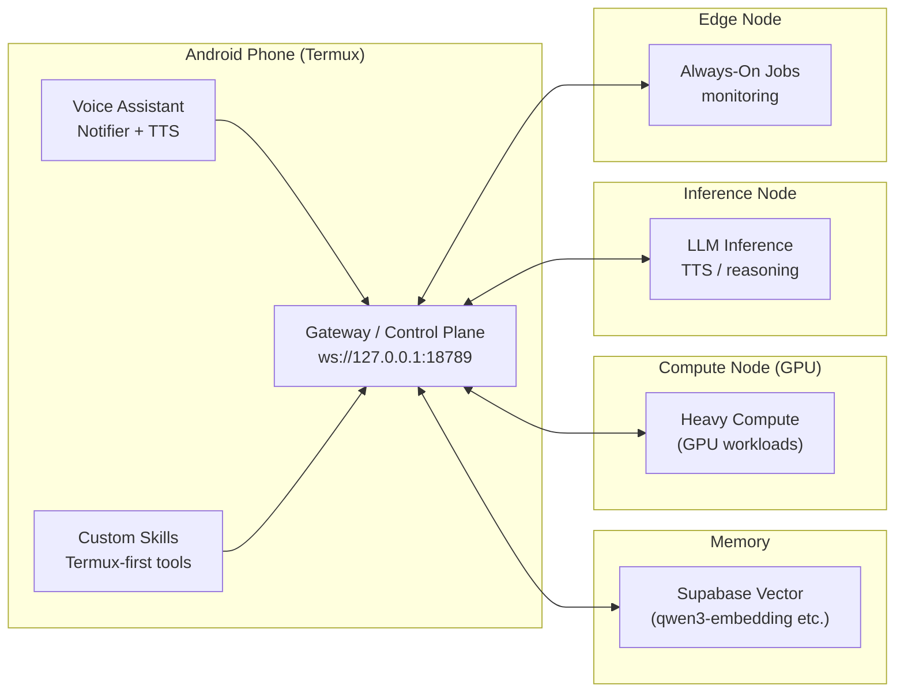

# Moltbot Termux Fork

<p align="center">
  
</p>

**Moltbot Termux Fork** is a Termux-optimized fork designed to run a personal AI assistant **natively on Android**.

- **Repo**: `yunze7373/openclaw-termux`
- **Positioning**: Android/Termux compatibility branch + multi-node distributed runtime

## What Makes This Fork Different

- ✅ **Android Termux native support**: no root, no standard Linux assumptions
- ✅ **Multi-node distributed architecture**: Termux as control plane + external compute nodes
- ✅ **Voice system**: tailored assistant voice workflow
- ✅ **Enhanced memory system**: Supabase Vector store + embeddings pipeline
- ✅ **Custom skills**: Termux-first tooling, automation, and node workflows

## Architecture (Multi-Node)


```mermaid
flowchart LR
  subgraph A["Android Phone (Termux)"]
    GW["Gateway / Control Plane\nws://127.0.0.1:18789"]
    VOICE["Voice Assistant\nNotifier + TTS"]
    SK["Custom Skills\nTermux-first tools"]
  end

  subgraph M["Memory"]
    SB["Supabase Vector\n(qwen3-embedding etc.)"]
  end

  subgraph W["Compute Node (GPU)"]
    C3D["Heavy Compute\n(GPU workloads)"]
  end

  subgraph MM["Inference Node"]
    OLL["LLM Inference\nTTS / reasoning"]
  end

  subgraph P["Edge Node"]
    EDGE["Always-On Jobs\nmonitoring"]
  end

  GW <--> SB
  VOICE --> GW
  SK --> GW

  GW <--> C3D
  GW <--> OLL
  GW <--> EDGE
```

## Install (Termux)

This repo targets **Android Termux** first.

### 0) Prerequisites

- Install **Termux**.
- (Recommended) Install **Termux:API** if you want clipboard/audio/dialog/toast capabilities.
- Android settings: set Termux / Termux:API battery mode to **Unrestricted** (or disable battery optimization), otherwise long-running gateway processes may be killed.

### 1) Packages

In Termux:

```bash
pkg update -y
pkg install -y git nodejs python make clang pkg-config

# Optional but useful on Android:
# pkg install -y termux-api chromium imagemagick
```

Enable pnpm via Corepack:

```bash
corepack enable
pnpm -v
```

### 2) Clone + Build

```bash
git clone https://github.com/yunze7373/openclaw-termux.git
cd openclaw-termux

pnpm install
pnpm ui:build
pnpm build
```

### 3) Run Gateway (Foreground)

```bash
node scripts/run-node.mjs gateway --port 18789 --verbose
```

Notes:
- Termux does not behave like a typical Linux distro: avoid hardcoding `/tmp`, avoid assuming `/bin/bash`.
- The CLI still exposes `moltbot`/`clawdbot` as compatibility shims.

### 4) Keep It Running (Manual Android Mode)

Termux cannot use systemd/launchd. Use a user-space process manager.

```bash
npm i -g pm2
pm2 start node --name moltbot -- scripts/run-node.mjs gateway --port 18789 --verbose
pm2 save
pm2 status
```

## Node Deployment (Distributed)

Typical production layout:

- **Main node**: Android (Termux) runs the Gateway and coordinates everything.
- **Compute node**: WSL2 provides GPU-heavy tasks.
- **Inference node**: Mac mini runs Ollama, TTS, or long-running inference services.
- **Edge node**: handles always-on small jobs and monitoring.

If you already have nodes registered, use your node runner workflow to attach them to the Gateway.

## Development Setup (From Source)

```bash
pnpm install
pnpm ui:build
pnpm build

# Dev loop (auto-reload on TS changes)
pnpm gateway:watch
```

## Tech Stack

- **Runtime**: Node.js `>= 22.12.0`
- **Language**: TypeScript
- **Memory**: Supabase Vector DB
- **Embeddings**: local/remote embedding pipeline (see project context)
- **Local inference**: Ollama (node-side integration)
- **Android tooling**: Termux + Termux:API

## Major Termux Changes (Compared to Upstream)

A non-exhaustive list of the key Android/Termux adaptations:

- Clipboard fallback: gracefully degrade to `termux-clipboard-get/set` when native bindings are missing.
- Temp dir fix: replace hardcoded `/tmp/...` with `os.tmpdir()`.
- Service manager: add **Manual (Android)** mode to avoid system service assumptions.
- PATH injection: ensure `/data/data/com.termux/files/usr/bin` is present for tool execution.
- Browser automation: detect Termux Chromium paths; document `pkg install chromium`.
- Storage hardening: tighten state directory permissions and security defaults.

See:
- `ANDROID_FIXES.md`
- `ANDROID_FIXES_CN.md`

## Relationship to Upstream

This is a **private, Termux-focused fork**.

- Forked from: `moltbot/moltbot` (upstream)
- Policy: periodically cherry-pick upstream changes, while keeping Android/Termux patches and custom enhancements stable.

## Documentation Index

- Project context: `PROJECT-CONTEXT.md`
- Android/Termux fixes: `ANDROID_FIXES.md`, `ANDROID_FIXES_CN.md`
- Contributing: `CONTRIBUTING.md`
- Security: `SECURITY.md`

## Security & Privacy

- Never commit API keys or tokens. Use placeholders like `sk-...` or `<YOUR_KEY>`.
- Treat inbound messages as untrusted input. Keep allowlists tight and review skill permissions.
