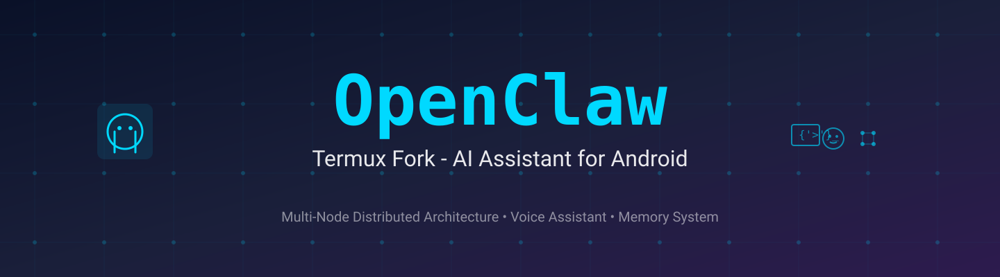
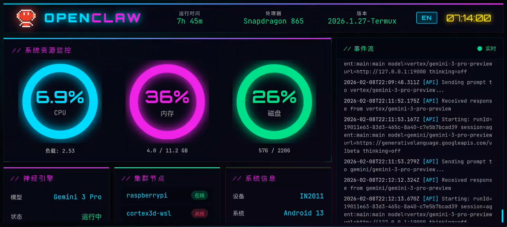
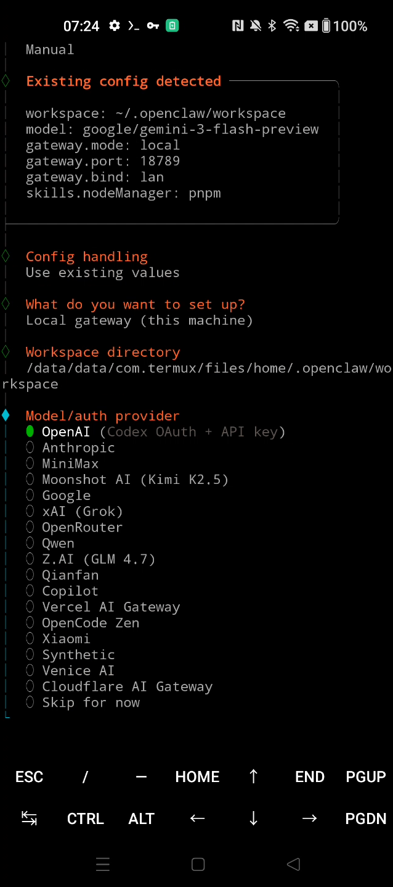
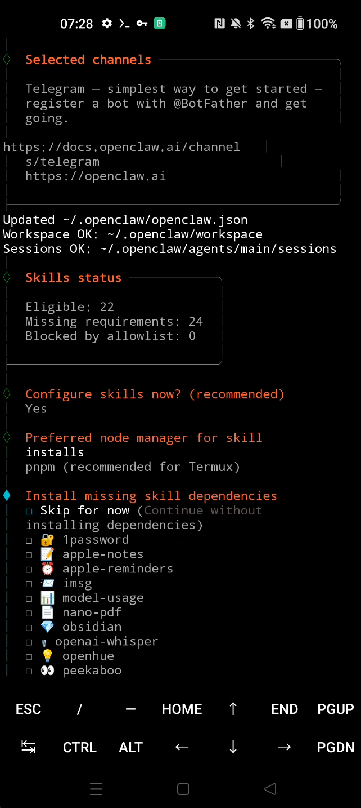

# OpenClaw (Termux)

<p align="center">
  
</p>

**OpenClaw** (Termux Fork) 是专为 **Android 原生运行** 优化的个人 AI 助手。无需 Root 权限，即可在 Termux 环境中体验完整的 OpenClaw 功能。

[English README](README.md) | [中文文档](README_CN.md)

## 🚀 为什么选择此 Fork？

本项目保持了原版 OpenClaw **100% 的功能特性**，同时解决了 Android/Termux 环境下的 50+ 兼容性问题。

| 特性 | 原版 OpenClaw | Termux版本 |
|---|---|---|
| 运行环境 | macOS/Linux 服务器 | 任意 Android 手机 |
| Termux 兼容 | ❌ | ✅ |
| 向量数据库 | 预编译二进制 (不兼容) | 源码编译/远程代理 |
| 后台管理 | systemd/launchd | PM2 |
| 硬件要求 | 电脑/服务器 | 闲置安卓机即可 |

### 主要适配

- ✅ **完美兼容 Termux** - 无需 Root，开箱即用
- ✅ **体验一致** - 功能与原版完全相同
- ✅ **低成本** - 废旧的二手手机即可作为私人 AI 服务器
- ✅ **环境修复** - 自动处理 npm/go/python 的路径和依赖问题
- ✅ **向量搜索** - 修复 sqlite-vec 在手机上的编译问题，支持 Supabase 远程向量
- ✅ **后台保活** - 内置 PM2 管理，确保助手 24 小时在线

详细修复列表请参考：[Termux 兼容性修复记录](ANDROID_FIXES_CN.md)

### 📸 运行截图


<br>

|  |  |
|:---:|:---:|


### 📱 进阶玩法 (软硬结合)

相比于运行在服务器或电脑上，OpenClaw 在手机上由于集成了 **Termux API**，拥有了直接控制物理硬件的能力。

> **提示**：安装 `Termux:API` 应用并运行 `pkg install termux-api` 即可解锁以下能力。

- **感知世界**：调用手机的光线、距离、重力传感器，甚至 GPS 位置。
- **物理反馈**：不只是语音，助手可以通过**震动**引擎、**闪光灯**节奏来传递信息。
- **多媒体控制**：播放音乐、调节音量、使用系统级 TTS (文本转语音) 进行语音播报。
- **通信中枢**：直接收发短信 (SMS)、拨打电话、获取联系人。
- **App 互联**：可以直接启动手机上的其他 App (如：`am start ...`)，甚至通过 Root 权限模拟点击/操作。

**Root 玩家特权**：
如果您的设备已 Root，OpenClaw 可以化身为真正的**24h 智能服务器**：
- **开机自启**：配置系统级自启动，像服务器一样断电自动恢复。
- **极致能效**：可改装**无电池直供电**模块，实现 24x365 天超低功耗运行。
- **远程管理**：通过局域网 (0.0.0.0) 或 **Tailscale** 随时随地安全访问 Web 界面。
- **系统接管**：管理后台进程、修改系统设置、模拟触控，完全无人值守。

**未来可扩展能力 (通过 Termux API)**：
- 📸 **视觉能力**：调用前后摄像头拍照/录像，实现家庭监控或环境感知。
- 🔋 **状态感知**：获取电量、WiFi 信号强度、蓝牙连接状态。
- 🗣️ **语音交互**：利用系统 TTS 进行语音播报，配合麦克风实现离线语音唤醒。
- 📩 **通信助理**：自动读取/发送短信，拦截骚扰电话，甚至作为短信转发网关。

### 🛸 终极形态：手机矩阵 (Matrix Cluster)

当您拥有多台废旧手机时，OpenClaw 可以组建**本地分布式集群**，实现更高级的玩法：

- **矩阵音频 (Audio Matrix)**：多台手机组成阵列麦克风系统，精确定位声源；或组成环绕立体声音响阵列。
- **全景视觉 (Visual Matrix)**：分散布置的手机摄像头组成 360° 无死角监控网络，甚至实现多机位“子弹时间”拍摄。
- **分布式算力 (Edge Cluster)**：10 台骁龙 865 算力总和远超普通 PC，可利用分布式推理框架运行更大参数的本地模型。
- **全屋感知 (Sensor Grid)**：手机作为独立的传感器节点 (光感/噪音/震动) 散布在房间各处，构建真正的全屋智能感知网。

---

## 快速开始

### 方案 1: npm 全局安装（最简单）

```bash
npm install -g openclaw-android
openclaw onboard
```

### 方案 2: 一键安装脚本

需要安装 **Termux** (建议 F-Droid 版本)。

```bash
# 克隆仓库
git clone https://github.com/yunze7373/openclaw-termux.git
cd openclaw-termux

# 运行中文安装脚本
./Install_termux_cn.sh --full
```

脚本会自动完成：
1. 安装 Node.js, Python, Go, PM2 等基础环境
2. 编译项目依赖
3. 适配 Android 系统路径
4. 启动后台服务

### 启动助手

安装完成后，运行以下命令初始化：

```bash
# 加载环境变量
source ~/.bashrc

# 安装推荐技能
openclaw onboard --install-daemon

# 启动网关 (Verbose 模式查看日志)
openclaw gateway --verbose
```

### 常用命令

```bash
# 与助手对话
openclaw agent --message "你好，请介绍一下你自己"

# 发送消息到手机
openclaw message send --to +8613800000000 --message "OpenClaw 测试消息"

# 查看后台状态
pm2 status
pm2 logs
```

## 文档与社区

- **官方文档**: [docs.openclaw.ai](https://docs.openclaw.ai)
- **提交反馈**: 请在 [Issues](https://github.com/yunze7373/openclaw-termux/issues) 中反馈 Termux 相关问题。
- **关注作者**: [X (Twitter) @hanyz_eth](https://x.com/hanyz_eth)

---

**特别感谢**：OpenClaw 原作者 Peter Steinberger 以及所有贡献者。
