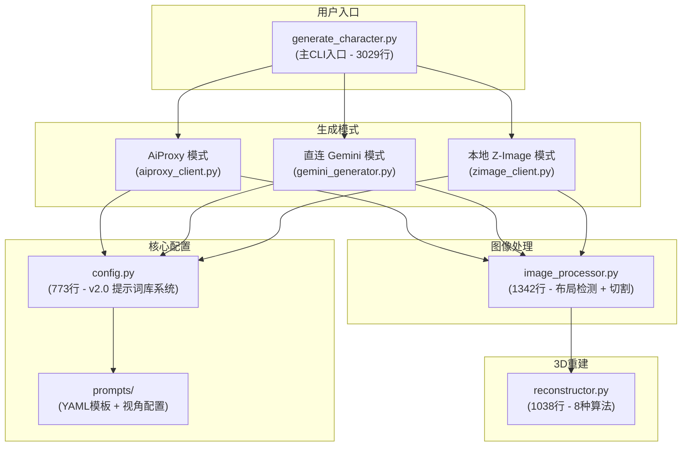
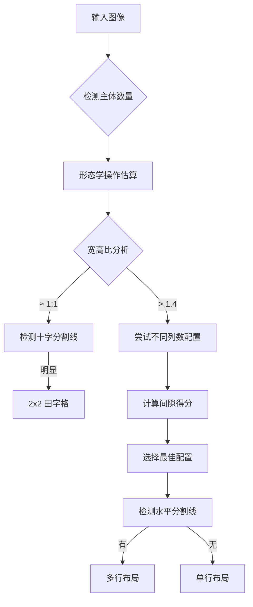
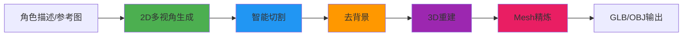
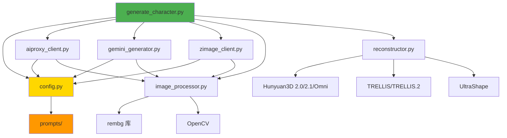

# Cortex3d 多视角图像生成系统分析报告

> **报告日期**: 2026-01-29 (更新)  
> **项目路径**: [c:\Users\han\source\repos\yunze7373\Cortex3d](file:///c:/Users/han/source/repos/yunze7373/Cortex3d)

---

## 〇、项目文件结构

```
Cortex3d/
├── 📄 核心配置
│   ├── compose.yml              # Docker Compose 配置 (7KB)
│   ├── requirements.txt         # Python 依赖
│   ├── Makefile                 # 构建/部署命令 (13KB)
│   └── .env.example             # 环境变量模板
│
├── 🐳 Docker 容器 (8个)
│   ├── Dockerfile               # 基础镜像
│   ├── Dockerfile.hunyuan3d     # Hunyuan3D 2.0
│   ├── Dockerfile.hunyuan3d-2.1 # Hunyuan3D 2.1 (10x精度)
│   ├── Dockerfile.hunyuan3d-omni# Hunyuan3D Omni (多模态)
│   ├── Dockerfile.trellis       # TRELLIS
│   ├── Dockerfile.trellis2      # TRELLIS.2
│   ├── Dockerfile.ultrashape    # UltraShape (Mesh精炼)
│   ├── Dockerfile.zimage        # Z-Image (本地生成)
│   └── Dockerfile.qwen-image-edit # Qwen图像编辑
│
├── 📜 scripts/ (核心脚本 - 36个)
│   ├── generate_character.py    # 主入口CLI (136KB, 3029行)
│   ├── config.py                # 配置中心 (27KB, 773行)
│   ├── aiproxy_client.py        # AiProxy客户端 (29KB, 781行)
│   ├── gemini_generator.py      # Gemini直连 (102KB, 2684行)
│   ├── image_processor.py       # 图像处理 (50KB, 1342行)
│   ├── reconstructor.py         # 3D重建调度 (45KB, 1038行)
│   ├── zimage_client.py         # Z-Image客户端 (18KB)
│   ├── zimage_server.py         # Z-Image服务端 (14KB)
│   ├── run_hunyuan3d.py         # Hunyuan3D运行脚本 (17KB)
│   ├── run_hunyuan3d_omni.py    # Hunyuan3D Omni (11KB)
│   ├── run_trellis.py           # TRELLIS运行脚本 (14KB)
│   ├── run_trellis2.py          # TRELLIS.2 (11KB)
│   ├── run_ultrashape.py        # UltraShape (30KB)
│   ├── smart_assistant.py       # 智能助手 (28KB)
│   ├── intelligent_assistant.py # 智能助理 (15KB)
│   ├── view_validator.py        # 视图验证 (41KB)
│   ├── mesh_sharpener.py        # Mesh锐化 (15KB)
│   ├── mesh_validator.py        # Mesh验证 (8KB)
│   ├── image_enhancer.py        # 图像增强 (9KB)
│   ├── image_editor_utils.py    # 编辑工具 (15KB)
│   ├── qwen_image_edit_client.py# Qwen编辑客户端 (9KB)
│   └── prompts/                 # 提示词库目录
│       ├── __init__.py          # PromptLibrary (26KB)
│       ├── styles.py            # 风格预设 (25KB)
│       ├── views.py             # 视角配置 (12KB)
│       ├── wardrobe.py          # 换装提示词 (11KB)
│       ├── multiview/           # 多视角YAML模板 (6个)
│       ├── composite/           # 合成YAML模板 (5个)
│       ├── negative/            # 负面提示词 (3个)
│       └── presets/             # 预设配置 (2个)
│
├── 🎭 poses/ (姿态控制 - 6个)
│   ├── a_pose.json              # A-Pose
│   ├── t_pose.json              # T-Pose
│   ├── action_hero.json         # 动作英雄
│   ├── sexy_standing.json       # 性感站姿
│   ├── standing_relaxed.json    # 放松站姿
│   └── sitting.json             # 坐姿
│
├── 📚 docs/ (文档 - 43个)
│   ├── 完整参数使用指南.md       # 主文档 (39KB)
│   ├── GEMINI_IMAGE_EDITING_INTEGRATION.md  # 编辑集成 (25KB)
│   ├── ULTRASHAPE_RESEARCH.md   # UltraShape研究 (17KB)
│   ├── PROMPT_IMPROVEMENT_ANALYSIS.md       # 提示词分析 (15KB)
│   ├── TRELLIS2_SETUP.md        # TRELLIS.2设置 (12KB)
│   └── ... (38个其他文档)
│
├── 📦 子模块
│   ├── InstantMesh/             # InstantMesh (58个文件)
│   └── TripoSR/                 # TripoSR (17个文件)
│
├── 📁 其他目录
│   ├── models/                  # 模型权重
│   ├── outputs/                 # 输出结果
│   ├── test_images/             # 测试图片
│   ├── reference_images/        # 参考图片
│   ├── configs/                 # 配置文件
│   ├── patches/                 # 补丁文件 (4个)
│   └── 2d图生成提示词/          # 提示词样例 (4个)
│
└── 📄 项目文档
    ├── README.md                # 项目说明 (12KB)
    ├── EDITING_QUICKSTART.md    # 编辑快速入门 (7KB)
    ├── P0_CHECKLIST.md          # P0检查清单 (7KB)
    ├── P0_COMPLETION_REPORT.md  # P0完成报告 (12KB)
    ├── P1_NAVIGATION_CENTER.md  # P1导航中心 (10KB)
    └── RECONSTRUCTOR_USAGE.md   # 重建器使用 (2KB)
```

---

## 一、系统架构概览



---

## 二、核心脚本功能解析

### 2.1 [config.py](file:///c:/Users/han/source/repos/yunze7373/Cortex3d/scripts/config.py) - 配置中心 (v2.0)

**主要职责**: 统一管理提示词模板、模型名称和API配置

> [!TIP]
> v2.0 重大更新：提示词模板迁移到 `prompts/` 目录，支持多视角模式

#### 模型配置
| 配置项 | 值 | 用途 |
|--------|------|------|
| `IMAGE_MODEL` | `models/nano-banana-pro-preview` | 图像生成模型 |
| `TEXT_MODEL` | `gemini-2.0-flash` | 文本分析模型 |
| `AIPROXY_BASE_URL` | `https://bot.bigjj.click/aiproxy` | API代理地址 |
| `ZIMAGE_LOCAL_URL` | `http://localhost:8199` | **[新增]** 本地Z-Image服务 |
| `ZIMAGE_MODEL` | `Tongyi-MAI/Z-Image-Turbo` | **[新增]** 本地生成模型 |

#### 生成后端
| 后端 | 描述 |
|------|------|
| `proxy` | AiProxy 代理服务 (默认) |
| `direct` | 直连 Gemini API |
| `local` | **[新增]** 本地 Z-Image 服务 |

#### 提示词模板函数

| 函数 | 行号 | 适用场景 |
|------|------|----------|
| [build_multiview_prompt()](file:///c:/Users/han/source/repos/yunze7373/Cortex3d/scripts/config.py#L124-L164) | L124-L164 | **文字生成模式** - 纯文字描述生成多视角 |
| [build_image_reference_prompt()](file:///c:/Users/han/source/repos/yunze7373/Cortex3d/scripts/config.py#L167-L206) | L167-L206 | **图片参考模式** - 保留原图动作 |
| [build_strict_copy_prompt()](file:///c:/Users/han/source/repos/yunze7373/Cortex3d/scripts/config.py#L209-L245) | L209-L245 | **严格复制模式** - 100%基于原图 |
| [build_composite_prompt()](file:///c:/Users/han/source/repos/yunze7373/Cortex3d/scripts/config.py#L248-L368) | L248-L368 | **[新增]** 合成模式 - 换装/配饰等 |
| [get_negative_prompt()](file:///c:/Users/han/source/repos/yunze7373/Cortex3d/scripts/config.py#L371-L387) | L371-L387 | **[新增]** 负面提示词获取 |
| [get_view_config()](file:///c:/Users/han/source/repos/yunze7373/Cortex3d/scripts/config.py#L394-L423) | L394-L423 | **[新增]** 视角配置获取 |

#### 新增功能

1. **多视角支持** (4/6/8 视角 + 自定义)
   ```python
   get_view_config(view_mode="6-view")
   # 返回: (views, rows, cols, aspect_ratio)
   ```

2. **主体隔离指令** (_build_subject_instructions)
   - `subject_only=True`: 移除背景物体
   - `with_props=["帽子", "包"]`: 保留指定道具

3. **负面提示词** (分类: anatomy, quality, layout)

---

### 2.2 [prompts/](file:///c:/Users/han/source/repos/yunze7373/Cortex3d/scripts/prompts) - 提示词库 (全新)

**目录结构**:
```
prompts/
├── __init__.py      (26KB - PromptLibrary 核心类)
├── styles.py        (25KB - 风格预设)
├── views.py         (12KB - 视角配置)
├── wardrobe.py      (11KB - 换装提示词)
├── multiview/       (6个YAML模板)
├── composite/       (5个YAML模板)
├── negative/        (3个负面提示词)
└── presets/         (2个预设配置)
```

#### 视角预设
| 预设 | 视角 |
|------|------|
| `4-view` | front, right, back, left |
| `6-view` | front, front_right, right, back, left, front_left |
| `8-view` | 6-view + top, bottom |

---

### 2.3 [generate_character.py](file:///c:/Users/han/source/repos/yunze7373/Cortex3d/scripts/generate_character.py) - 主入口CLI (3029行)

**主要职责**: 统一的命令行入口，支持多种生成模式和完整流水线

#### 支持的运行模式

| 模式 | 命令参数 | 说明 |
|------|----------|------|
| AiProxy模式 | `--mode proxy` (默认) | 通过代理服务调用NanoBanana |
| 直连模式 | `--mode direct` | 直接调用Gemini API |
| **[新增]** 本地模式 | `--mode local` | 使用本地Z-Image服务 |
| 图片参考模式 | `--from-image <path>` | 从参考图片生成多视角 |
| 严格复制模式 | `--from-image <path> --strict` | 100%基于原图生成 |
| 快速ID模式 | `--from-id <uuid>` | 跳过2D生成，直接用已有图片 |

#### 新增功能

1. **迭代360度生成** ([_iterative_360_generation](file:///c:/Users/han/source/repos/yunze7373/Cortex3d/scripts/generate_character.py#L36-L263))
   - 按顺序生成多个视图
   - 每个视图使用前一个生成的图像作为参考

2. **主体隔离**
   - `--subject-only`: 只处理主体，移除背景
   - `--with-props "item1,item2"`: 保留指定道具

3. **提示词导出**
   - `--export-prompt`: 导出提示词而不调用API

---

### 2.4 [gemini_generator.py](file:///c:/Users/han/source/repos/yunze7373/Cortex3d/scripts/gemini_generator.py) - 直连Gemini API (2684行)

**主要职责**: 直接调用Google Gemini API生成和编辑图像

#### 核心函数

| 函数 | 行号 | 功能 |
|------|------|------|
| [generate_character_views()](file:///c:/Users/han/source/repos/yunze7373/Cortex3d/scripts/gemini_generator.py#L67-L583) | L67-L583 | 生成多视图角色图像 |
| [edit_character_elements()](file:///c:/Users/han/source/repos/yunze7373/Cortex3d/scripts/gemini_generator.py#L590-L680) | L590-L680 | **[新增]** 编辑角色元素 |
| [refine_character_details()](file:///c:/Users/han/source/repos/yunze7373/Cortex3d/scripts/gemini_generator.py#L920-L1012) | L920-L1012 | **[新增]** 优化特定细节 |
| [style_transfer_character()](file:///c:/Users/han/source/repos/yunze7373/Cortex3d/scripts/gemini_generator.py#L1019-L1106) | L1019-L1106 | **[新增]** 风格转换 |
| [preserve_detail_edit()](file:///c:/Users/han/source/repos/yunze7373/Cortex3d/scripts/gemini_generator.py#L1113-L1219) | L1113-L1219 | **[新增]** 高保真细节保留编辑 |

#### 编辑功能优先级

| 优先级 | 功能 | 描述 |
|--------|------|------|
| P0 | 元素编辑 | 添加/移除/修改角色元素 |
| P0 | 高保真编辑 | 保留关键细节的精确编辑 |
| P0 | 细节优化 | 语义遮盖优化特定部位 |
| P1 | 风格转换 | anime/cinematic/oil-painting等 |

---

### 2.5 [aiproxy_client.py](file:///c:/Users/han/source/repos/yunze7373/Cortex3d/scripts/aiproxy_client.py) - AiProxy API客户端 (781行)

**主要职责**: 通过代理服务调用AI图像生成API

#### 核心函数

| 函数 | 行号 | 功能 |
|------|------|------|
| [generate_image_via_proxy()](file:///c:/Users/han/source/repos/yunze7373/Cortex3d/scripts/aiproxy_client.py#L55-L183) | L55-L183 | 调用代理API生成图像 |
| [extract_image_from_reply()](file:///c:/Users/han/source/repos/yunze7373/Cortex3d/scripts/aiproxy_client.py#L186-L216) | L186-L216 | 从HTML响应中提取base64图像 |
| [analyze_image_for_character()](file:///c:/Users/han/source/repos/yunze7373/Cortex3d/scripts/aiproxy_client.py#L219-L366) | L219-L366 | 图片分析 - 提取角色详细描述 |
| [generate_character_multiview()](file:///c:/Users/han/source/repos/yunze7373/Cortex3d/scripts/aiproxy_client.py#L373-L713) | L373-L713 | 完整的多视角生成流程 |

#### 新增参数支持

- `negative_prompt`: 负面提示词
- `subject_only`: 主体隔离
- `with_props`: 道具保留列表
- `export_prompt`: 提示词导出

---

### 2.6 [image_processor.py](file:///c:/Users/han/source/repos/yunze7373/Cortex3d/scripts/image_processor.py) - 图像处理器 (1342行)

**主要职责**: 智能布局检测、图像切割、背景移除、碎片清理

#### 支持的布局类型

| 布局 | 检测条件 | 视图顺序 |
|------|----------|----------|
| 1x4 横排 | 宽高比 > 1.4, 3条垂直分割线 | front → right → back → left |
| 2x2 田字格 | 宽高比 ≈ 1:1, 十字分割线 | front, right, back, left |
| MxN 通用网格 | 自动检测 | view_1, view_2, ... |

#### 布局检测算法



#### 核心函数

| 函数 | 行号 | 功能 |
|------|------|------|
| [detect_grid_layout()](file:///c:/Users/han/source/repos/yunze7373/Cortex3d/scripts/image_processor.py#L288-L586) | L288-L586 | 通用网格布局检测 |
| [detect_layout_smart()](file:///c:/Users/han/source/repos/yunze7373/Cortex3d/scripts/image_processor.py#L691-L849) | L691-L849 | 多重检测智能判断 |
| [split_universal_grid()](file:///c:/Users/han/source/repos/yunze7373/Cortex3d/scripts/image_processor.py#L589-L688) | L589-L688 | 根据网格布局切割 |
| [remove_small_fragments()](file:///c:/Users/han/source/repos/yunze7373/Cortex3d/scripts/image_processor.py#L107-L195) | L107-L195 | 碎片移除 (连通组件分析) |
| [crop_to_subject()](file:///c:/Users/han/source/repos/yunze7373/Cortex3d/scripts/image_processor.py#L198-L285) | L198-L285 | 智能裁切到主体 |

---

### 2.7 [reconstructor.py](file:///c:/Users/han/source/repos/yunze7373/Cortex3d/scripts/reconstructor.py) - 3D重建调度器 (1038行)

**主要职责**: 统一调度多种3D重建算法

#### 支持的3D算法

| 算法 | 函数 | 描述 |
|------|------|------|
| InstantMesh | [run_instantmesh()](file:///c:/Users/han/source/repos/yunze7373/Cortex3d/scripts/reconstructor.py#L104-L138) | 多视图重建 |
| TripoSR | [run_triposr()](file:///c:/Users/han/source/repos/yunze7373/Cortex3d/scripts/reconstructor.py#L162-L190) | 快速单图重建 |
| TRELLIS | [run_trellis()](file:///c:/Users/han/source/repos/yunze7373/Cortex3d/scripts/reconstructor.py#L268-L351) | 微软高质量模型 |
| TRELLIS.2 | [run_trellis2()](file:///c:/Users/han/source/repos/yunze7373/Cortex3d/scripts/reconstructor.py#L538-L619) | 官方结构化潜在表示 |
| Hunyuan3D 2.0 | [run_hunyuan3d()](file:///c:/Users/han/source/repos/yunze7373/Cortex3d/scripts/reconstructor.py#L354-L446) | 腾讯高质量模型 |
| Hunyuan3D 2.1 | [run_hunyuan3d_21()](file:///c:/Users/han/source/repos/yunze7373/Cortex3d/scripts/reconstructor.py#L449-L535) | 10x几何精度 + PBR材质 |
| **[新增]** Hunyuan3D Omni | [run_hunyuan3d_omni()](file:///c:/Users/han/source/repos/yunze7373/Cortex3d/scripts/reconstructor.py#L622-L710) | 多模态控制 (pose/point/voxel/bbox) |
| **[新增]** UltraShape | [run_ultrashape()](file:///c:/Users/han/source/repos/yunze7373/Cortex3d/scripts/reconstructor.py#L713-L788) | Mesh 精炼 |

#### Hunyuan3D-Omni 控制类型

| 控制类型 | 描述 | 输入格式 |
|----------|------|----------|
| `pose` | 姿态控制 | JSON骨骼数据 |
| `point` | 点云控制 | PLY/NPY文件 |
| `voxel` | 体素控制 | 体素网格 |
| `bbox` | 边界框控制 | 3D边界框 |

#### UltraShape 预设

| 预设 | 描述 |
|------|------|
| `lowmem` | 低内存模式 |
| `fast` | 快速模式 |
| `balanced` | 平衡模式 (默认) |
| `high` | 高质量模式 |
| `ultra` | 超高质量模式 |

---

## 三、完整流水线



---

## 四、使用示例

### 基础用法

```bash
# 文字生成模式 (4视角)
python scripts/generate_character.py "赛博朋克女战士"

# 6视角模式
python scripts/generate_character.py "赛博朋克女战士" --view-mode 6-view

# 图片参考模式
python scripts/generate_character.py --from-image reference.jpg "改成金发"

# 严格复制模式
python scripts/generate_character.py --from-image photo.jpg --strict

# 本地模式 (Z-Image)
python scripts/generate_character.py "末日幸存者" --mode local

# 主体隔离
python scripts/generate_character.py --from-image street.jpg --strict --subject-only

# 保留道具
python scripts/generate_character.py --from-image photo.jpg --strict --with-props "帽子,背包"
```

### 完整流水线 (2D→3D)

```bash
# Hunyuan3D-2.1
python scripts/generate_character.py "末日幸存者" --to-3d --algo hunyuan3d-2.1

# Hunyuan3D-Omni (姿态控制)
python scripts/generate_character.py "战士" --to-3d --algo hunyuan3d-omni \
    --control-type pose --control-input poses/a_pose.json

# 带 Mesh 精炼
python scripts/generate_character.py "角色" --to-3d --algo trellis2 --refine ultrashape
```

---

## 五、文件依赖关系



---

## 六、总结

Cortex3d 的多视角生成系统已进行重大升级：

| 特性 | 旧版 | 新版 (v2.0) |
|------|------|------|
| 提示词管理 | 硬编码 | YAML模板 + PromptLibrary |
| 视角支持 | 4视角 | 4/6/8视角 + 自定义 |
| 生成后端 | proxy/direct | proxy/direct/local |
| 负面提示词 | 无 | 分类支持 (anatomy/quality/layout) |
| 图像编辑 | 无 | 元素编辑/细节优化/风格转换 |
| 3D算法 | 5种 | 8种 (含Omni + UltraShape) |
| 主体隔离 | 无 | 支持 (subject_only/with_props) |

核心优势：
1. **模块化设计** - 配置、生成、处理分离，易于维护
2. **多模式支持** - 文字生成、图片参考、严格复制、合成等
3. **智能布局检测** - 支持多种网格布局自动识别
4. **完整流水线** - 从2D生成到3D重建一键完成
5. **多视角扩展** - 支持4/6/8视角及自定义视角
6. **本地生成** - 新增Z-Image本地服务支持
